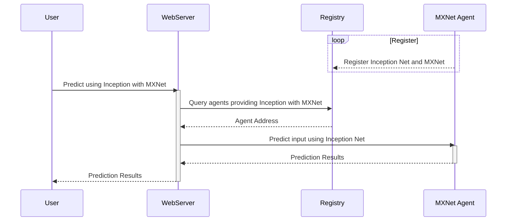

# Predictions

## Request

```mermaid
sequenceDiagram
participant User
participant WebServer
participant Registry
participant MXNet Agent
loop Register
   MXNet Agent-->> Registry: Register Inception Net and MXNet
end
User->> WebServer: Predict using Inception with MXNet
activate WebServer
WebServer->> Registry: Query agents providing Inception with MXNet
Registry-->>WebServer: Agent Address
WebServer->>MXNet Agent: Predict input using Inception Net
activate MXNet Agent
MXNet Agent-->>WebServer: Prediction Results
deactivate MXNet Agent
WebServer-->>User: Prediction Results
deactivate WebServer
```
